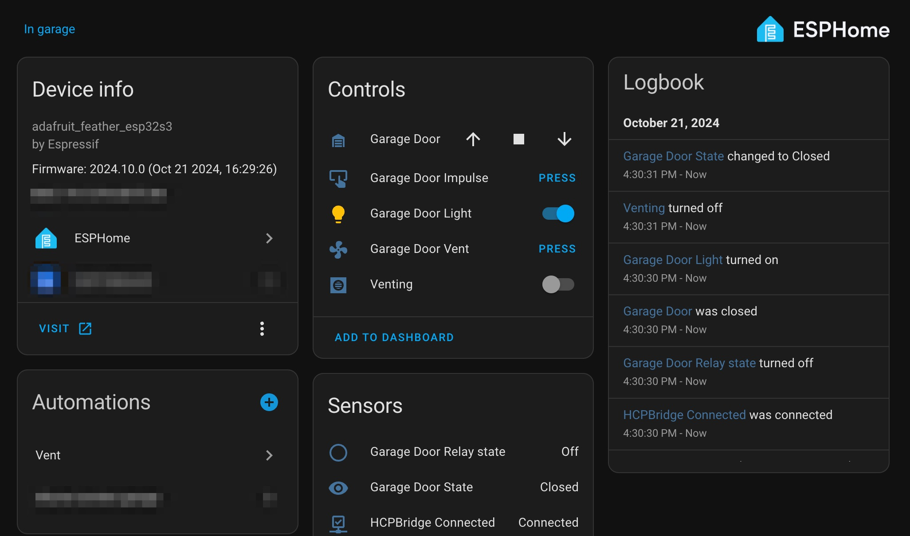

# esphome-hcpbridge

[](https://github.com/14yannick/esphome-hcpbridge/blob/main/LICENSE)
[](https://github.com/14yannick/esphome-hcpbridge)
[](https://github.com/sponsors/mapero)


This is a esphome-based adaption of the HCPBridge. thanks to [mapero](https://github.com/14yannick/esphome-hcpbridge) for the initial esphome port. Credits for the initial development of the HCPBridge go to [Gifford47](https://github.com/Gifford47/HCPBridgeMqtt), [hkiam](https://github.com/hkiam/HCPBridge) and all the other guys contributed.

## Usage

### Example esphome configuration

```YAML
substitutions:
  name: "hcpbridge"
  friendly_name: "Garage Door"
esphome:
  name: "${name}"
  friendly_name: "${friendly_name}"
  libraries:
    - emelianov/modbus-esp8266 # Required for communication with the modbus
  platformio_options:
    board_build.f_cpu: 240000000L

external_components:
    source: github://14yannick/esphome-hcpbridge
    refresh: 0s # Ensure you always get the latest version

esp32:
  board: #adafruit_feather_esp32s3 #set your board
  framework:
    type: arduino

hcpbridge:
  id: hcpbridge_id
  rx_pin: 18 # optional, default=18
  tx_pin: 17 # optional, default=17
  #rts_pin : 1 # optional RTS pin to use if hardware automatic control flow is not available.

cover:
  - platform: hcpbridge
    name: ${friendly_name}
    device_class: garage
    id: garagedoor_cover
```

### Home Assistant



### Cover

The component provides a cover component to control the garage door.

### Light

The component provides a Light component to turn the light off and on.
The Output is needed to control the light.
```YAML
output:
  - platform: hcpbridge
    id: output_light

light:
  - platform: hcpbridge
    id: gd_light
    output: output_light
    name: Garage Door Light
```
### Binary_Sensor

The component provides you two sensor.

- `is_connected`: Who indicated if there is a valid connection with the door.
- `relay_state`: Give the status of the option relay (Menu 30) of the HCP.
```YAML
binary_sensor:
  - platform: hcpbridge
    is_connected:
      name: "HCPBridge Connected"
      id: sensor_connected
    relay_state:
      name: "Garage Door Relay state"
      id: sensor_relay
      #on_state:
      #create your automation based on Garage Door Relay state
```
### Text_sensor

This component provide you a detailed current state of the door. This text can be changed using the substitute functionality.
```YAML
text_sensor:
  - platform: hcpbridge
    id: sensor_templ_state
    name: "Garage Door State"
```
### sensor

This component provide you the position of the door in %. Where 100% is fully open.
```YAML
sensor:
  - platform: hcpbridge
    id: sensor_position
    name: ${sen_pos}
```
### Button

This component allows you to add three buttons to sond commands to the door.
```YAML
button:
  - platform: hcpbridge
    vent_button:
      id: button_vent
      name: "Garage Door Vent"
    impulse_button:
      id: button_impulse
      name: "Garage Door Impulse"
    half_button:
      id: button_half
      name: "Half"
```

### Switch

This component allows you to add two switch to sond commands to the door.
```YAML
switch:
  - platform: hcpbridge
    vent_switch:
      id: switch_vent
      name: "Venting"
      restore_mode: disabled
    half_switch:
      id: half_switch
      name: "Open Half"
      restore_mode: disabled
```

### Services

Additionally, when using the cover component, you can expose the following services to the API:

- `esphome.hcpbridge_go_to_close`: To close the garage door
- `esphome.hcpbridge_go_to_half`: To move the garage door to half position
- `esphome.hcpbridge_go_to_vent`: To move the garage door to the vent position
- `esphome.hcpbridge_go_to_open`: To open the garage door
- `esphome.hcpbridge_toggle`: Send an Impulse command to the door

There are in the YAML and not directly in the Cover to remove the API dependency there. This give the possibility to use the Cover without the API Component for exemple only with the web_server or mqtt.
```YAML
api:
  encryption:
    key: !secret api_key
  services:
    - service: go_to_open
      then:
        - lambda: |-
            id(garagedoor_cover).on_go_to_open();
    - service: go_to_close
      then:
        - lambda: |-
            id(garagedoor_cover).on_go_to_close();
    - service: go_to_half
      then:
        - lambda: |-
            id(garagedoor_cover).on_go_to_half();
    - service: go_to_vent
      then:
        - lambda: |-
            id(garagedoor_cover).on_go_to_vent();
    - service: toggle
      then:
        - cover.toggle: garagedoor_cover
```

### Example YAML

Check out the [example_hcpbridge.yaml](./example_hcpbridge.yaml) for a complete yaml with all hcpbridge components.

# Project

- HCPBridge from `Tysonpower` on an `Hörmann Promatic 4`

You can find more information on the project here: [Hörmann garage door via MQTT](https://community.home-assistant.io/t/hormann-garage-door-via-mqtt/279938/340)
Known working hardware are the ESP32 and S3 dual core chip.

# ToDo

- [x] Initial working version
- [ ] Use esphome modbus component instead of own code
- [x] Map additional functions to esphome
- [x] Use callbacks instead of pollingComponent (Only hcpbridge is polling)
- [x] Expert options for the HCPBridge component (GPIOs ...)

# Contribute

I am open for contribution. Just get in contact with me.

# License

```
MIT License

Copyright (c) 2023 Jochen Scheib

Permission is hereby granted, free of charge, to any person obtaining a copy
of this software and associated documentation files (the "Software"), to deal
in the Software without restriction, including without limitation the rights
to use, copy, modify, merge, publish, distribute, sublicense, and/or sell
copies of the Software, and to permit persons to whom the Software is
furnished to do so, subject to the following conditions:

The above copyright notice and this permission notice shall be included in all
copies or substantial portions of the Software.

THE SOFTWARE IS PROVIDED "AS IS", WITHOUT WARRANTY OF ANY KIND, EXPRESS OR
IMPLIED, INCLUDING BUT NOT LIMITED TO THE WARRANTIES OF MERCHANTABILITY,
FITNESS FOR A PARTICULAR PURPOSE AND NONINFRINGEMENT. IN NO EVENT SHALL THE
AUTHORS OR COPYRIGHT HOLDERS BE LIABLE FOR ANY CLAIM, DAMAGES OR OTHER
LIABILITY, WHETHER IN AN ACTION OF CONTRACT, TORT OR OTHERWISE, ARISING FROM,
OUT OF OR IN CONNECTION WITH THE SOFTWARE OR THE USE OR OTHER DEALINGS IN THE
SOFTWARE.
```
